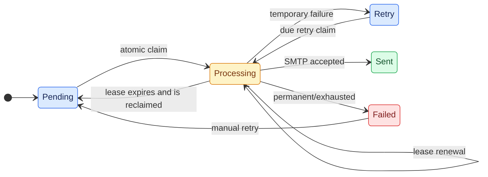

# Casko.Messaging.Email.BulkDelivery

Provider-independent contracts and validation for durable bulk email delivery.

## Responsibility

- `INotificationWriter` creates events, appends recipients, and atomically creates notification batches.
- `INotificationQueueStore` claims deliveries and guards updates with live lease ownership.
- `INotificationStoreInitializer` initializes provider-owned persistence.
- Requests/results, normalization, validation and status values are shared; no EF or database-driver dependencies.

## Delivery lifecycle

## Boundaries

The SQL Server implementation lives in `Casko.Messaging.Email.BulkDelivery.SqlServer`. The worker owns SMTP transport; callers resolve domain recipients. An ingestion call owns its own transaction. A separate domain database transaction is not automatically atomic with an HTTP call; an application's own outbox is required to bridge that boundary reliably.

Providers must guarantee atomic batch writes, idempotent events and recipients, exclusive work claiming, expired-lease reclamation, and guarded updates. The transport remains at-least-once: SMTP acceptance and the database's sent update cannot be committed together.

## Ingestion contract

Each event has an immutable EntityId, EventType, Template, and Message. Reusing an idempotency key with identical content returns the existing event and adds missing recipients. Different content is a conflict and rolls back the entire call. An event may have no recipients and receive them later.

Each event also has an immutable Priority: `Bulk` (0), `Normal` (1, the default), or `Critical` (2). Its deliveries retain that value across retries. Choose `Critical` for password resets and security notifications, `Normal` for transactional mail, and `Bulk` for campaigns. A different priority under the same idempotency key is a conflict.

Recipient identity is the event ID plus trim/uppercase-normalized email address. Input duplicates retain the first RecipientId/address; existing delivery metadata is never overwritten. A batch result contains one entry per distinct event key, with ID, creation timestamp, Created, AddedRecipients, ExistingRecipients, DuplicateRecipients, and DuplicateEvents. Recipient duplicates are counted across repeated event inputs too.

Counts describe the committed attempt. Retrying after a lost response can return Created=false and existing-recipient counts. There is no persistent batch ID or batch status resource. Split larger imports into bounded requests; atomicity applies to each request separately.

## Future providers

Add a provider project referencing this project, implement the three interfaces, and expose a provider-specific registration extension. Keep database entities, concurrency representations and migrations inside that project. Change registration in the API/worker and the AppHost database resource; HTTP and SMTP code consume the same contracts.

Reuse the persistence contract tests with a fixture for the new provider. PostgreSQL would supply its own copy/upsert and claim/lease implementation and migrations; no PostgreSQL package or implementation is included now. Match or deliberately migrate the existing provider's key equality semantics before moving data.
