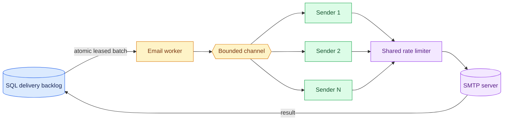

# Casko.Messaging.Email.Worker

Dedicated .NET worker that drains the durable SQL delivery backlog through SMTP.

## Responsibility

- Claims a bounded batch through `INotificationQueueStore` from the configured persistence provider.
- Sends with configured bounded concurrency and optional global message-rate limiting.
- Renders the immutable inline event template immediately before SMTP delivery.
- Reuses one MailKit SMTP client per sender loop, renews active leases, and persists the result of every attempt.

## Processing flow

## Configuration

Configure `EmailDelivery` with `BatchSize`, `Concurrency`, `MaximumAttempts`, `MaximumMessagesPerSecond`, `PollInterval`, and `ProcessingLeaseDuration`. The defaults are deliberately gentle for local testing: 10 deliveries per batch, one SMTP sender loop, three attempts, one message per second, two-second polling, and a five-minute lease.

Critical mail has a separate lane configured by `CriticalBatchSize`, `CriticalConcurrency`, and `CriticalMaximumMessagesPerSecond`. It claims only `Critical` deliveries; the standard lane claims `Normal` and `Bulk`. `BulkPromotionAfter` promotes old bulk rows into normal ordering to prevent starvation. The default rate limits allow one standard and one critical message per second, so configure both below your SMTP provider's aggregate limit.

SMTP settings use `Email:MailKit`. Run through `Casko.Messaging.AppHost` to receive the SQL and MailPit connection configuration automatically.

Startup registers the SQL Server provider with `AddSqlServerNotifications`; migration initialization uses `INotificationStoreInitializer`. Delivery logic references only shared contracts, allowing a future provider to replace persistence registration without changing SMTP handling.

## Boundaries

The worker is an at-least-once transport. A process can fail after SMTP accepts a message but before SQL records `Sent`; deterministic per-delivery message IDs and guarded lease ownership updates reduce duplicate delivery risk. Do not move notification creation, recipient fan-out, or domain status-change handling into this project.
